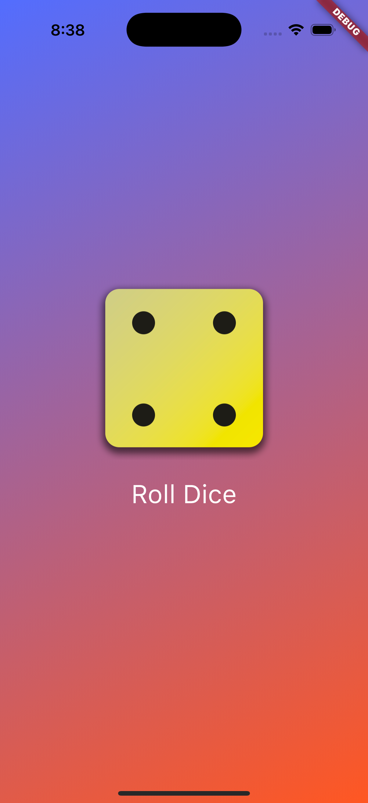

## Project 00: Dice Rolling App

Super simple app. Just press a button and get a random dice roll. Nothing fancy, just a nice casual intro to Flutter and Dart to learn the basics.

[GitHub repo](https://github.com/Phillip-D-Shields/flutter_roll_dice_app)

## Project 01: Quiz App

A quiz app about using Flutter. The app uses dummy data for the questions, but the code makes for great boilerplate for future projects that import data from external sources. The quiz app was a great intro into state management in Flutter and Dart, and there are lots of Dart features used in the code like ternary operators, if statements, for loops, and conditional rendering. 

[GitHub repo](https://github.com/Phillip-D-Shields/flutter_quiz_app)

## Project 02: Expense Tracking App

This app was a big step up from the previous. There is more interactivity, a wider number of custom and standard widgets, some basic theming, and responsive design that allows the app to be viewed and used via portrait or landscape on mobile devices. 

[GitHub repo](https://github.com/Phillip-D-Shields/flutter_expense_tracker)

<!-- TODO todo app -->

<!-- TODO meals app -->

<!-- TODO shopping list app -->

<!-- TODO favorite places app -->